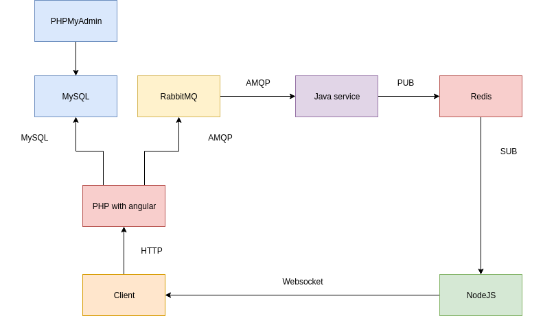

# the-most-unnecessarily-complicated-app
An absurd app, that is unnecessarily complicated, in order to show off docker compose

## Objective
Have an interface where you can see messages and post them

##Components

###PHP service
- serves js files and has getMessages and addMessage endpoint
- stores the new message in the db
- serves messages from the db
- pushes to a rabbitmq server the new message
- Symfony 4

###Java service
- reads from a queue, gets new message
- publishes to a redis topic
- standard java 8

###Nodejs service
- subscribes to a topic
- on receiving a message, pushes it to the websocket clients
- nodejs 11

###Other services
- RabbitMQ server (latest)
- Redis server (latest)
- MySQL server (latest)
